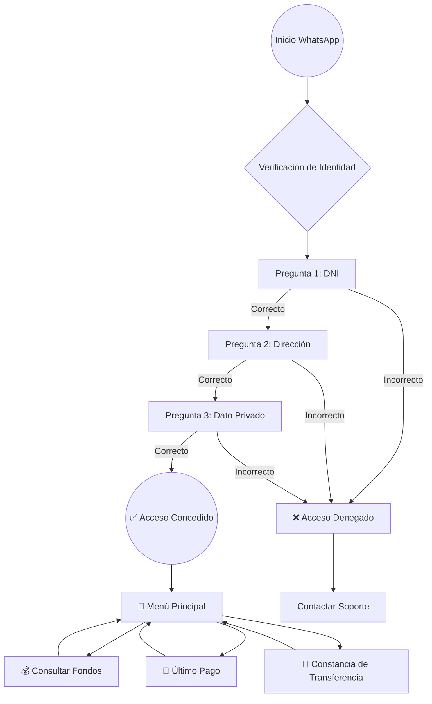
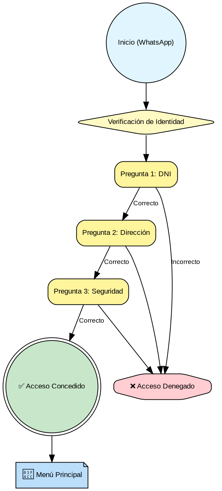

# Diagrama de Flujo: Bot WhatsApp Financiero

Este diagrama representa el flujo de interacción y verificación para el Bot de WhatsApp.

```mermaid
graph TD
    Start((Inicio WhatsApp)) --> Verify{Verificación de Identidad}
    
    Verify --> Q1[Pregunta 1: DNI]
    
    Q1 -- Correcto --> Q2[Pregunta 2: Dirección]
    Q1 -- Incorrecto --> AccessDenied[❌ Acceso Denegado]
    
    Q2 -- Correcto --> Q3[Pregunta 3: Dato Privado]
    Q2 -- Incorrecto --> AccessDenied
    
    Q3 -- Correcto --> AccessGranted((✅ Acceso Concedido))
    Q3 -- Incorrecto --> AccessDenied
    
    AccessGranted --> Menu[📌 Menú Principal]
    
    Menu --> Opt1[💰 Consultar Fondos]
    Menu --> Opt2[📅 Último Pago]
    Menu --> Opt3[📄 Constancia de Transferencia]
    
    Opt1 --> Menu
    Opt2 --> Menu
    Opt3 --> Menu
    
    AccessDenied --> Support[Contactar Soporte]
```

## Equivalente en Graphviz (Código)

```dot
digraph WhatsAppBot {
    rankdir=TB;
    node [shape=box, style="filled,rounded", fontname="Arial", fontsize=10];
    edge [fontname="Arial", fontsize=9];

    Start [label="Inicio (WhatsApp)", shape=circle, fillcolor="#E1F5FE"];
    Verify [label="Verificación de Identidad", shape=diamond, fillcolor="#FFF9C4"];
    
    Q1 [label="Pregunta 1: DNI", fillcolor="#FFF59D"];
    Q2 [label="Pregunta 2: Dirección", fillcolor="#FFF59D"];
    Q3 [label="Pregunta 3: Seguridad", fillcolor="#FFF59D"];
    
    AccessGranted [label="✅ Acceso Concedido", shape=doublecircle, fillcolor="#C8E6C9"];
    AccessDenied [label="❌ Acceso Denegado", shape=octagon, fillcolor="#FFCDD2"];

    Menu [label="📌 Menú Principal", shape=note, fillcolor="#BBDEFB"];
    
    Start -> Verify -> Q1;
    Q1 -> Q2 [label="Correcto"];
    Q2 -> Q3 [label="Correcto"];
    Q3 -> AccessGranted [label="Correcto"];
    
    Q1 -> AccessDenied [label="Incorrecto"];
    Q2 -> AccessDenied;
    Q3 -> AccessDenied;
    
    AccessGranted -> Menu;
}
```
